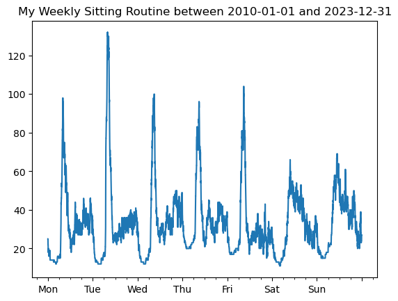

# Plotting data from Meditation Helper

I've used the [Meditation Helper Plus](https://play.google.com/store/apps/details?id=com.multiordinal.mhp) android app for a while now (10+ years!). 
It has a nice widget that lets you keep a chain of days where you meditated. Keeping the chain going is a nice way to keep yourself build a daily practice and keep motivated to meditate every day. (I'm currently at 3,654 days in a row!)

The app also lets you export your data as a CSV file. I've done this a few times over the years, but never really looked at the data. I was curious to see how my meditation practice has changed over the years, so I decided to plot the data.

Here's a few bits of code to do that. 

And here's all the data from the last 10 years, showing what point I typically meditate each day of the week.

Caspar Addyman, October 2023
